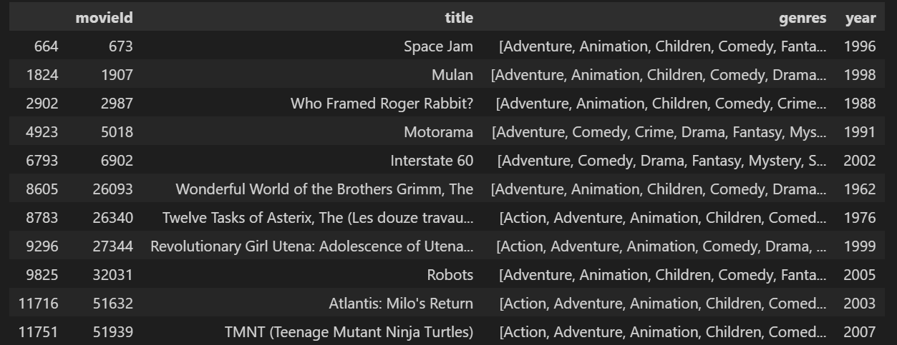

# Recommendation-system-content-based


<br>


## Table of contents

- [Objective](#Objective)
- [Overview](#Overview)
- [Technologies used](#Technologies-used)
- [Methodology](#project-description)
- [Results](#project-results)

## Objective
[(Back to top)](#Table-of-contents)

In this notebook, we will explore Content-based recommendation systems and implement a simple version of one using Python and the Pandas library.

## Overview
[(Back to top)](#Table-of-contents)

Recommendation systems are a collection of algorithms used to recommend items to users based on information taken from the user. These systems have become ubiquitous, and can be commonly seen in online stores, movies databases and job finders.
Now, let's take a look at how to implement **Content-Based** or **Item-Item recommendation systems**. This technique attempts to figure out what a user's favourite aspects of an item is, and then recommends items that present those aspects. In our case, we're going to try to figure out the input's favorite genres from the movies and ratings given.

## Technologies used
[(Back to top)](#Table-of-contents)


## Methodology

[(Back to top)](#Table-of-contents) 

### Dataset

The fields in each record are:

| Field name  | Description                 |
| ----------- | --------------------------- |
| ID          |Movies Id                    |
| Title       | Title of the Movies          |
| Genre       | Categories under wich lies the Movies |

### Data Processing

* Proper Formatting
* One Hot Encoding

### Implementation

* We take user Input to better Know the User and base the recommendations on what suits him the most :

```python3
userInput = [
{'title':'Breakfast Club, The', 'rating':5},
{'title':'Toy Story', 'rating':3.5},
{'title':'Jumanji', 'rating':2},
{'title':"Pulp Fiction", 'rating':5},
{'title':'Akira', 'rating':4.5}] 
inputMovies = pd.DataFrame(userInput)
inputMovies  
```


We apply some Data manipulation using pandas to extract the recommandation DataFrame.

## Results
We get the final recommendation table with the Movies user might like :
 

